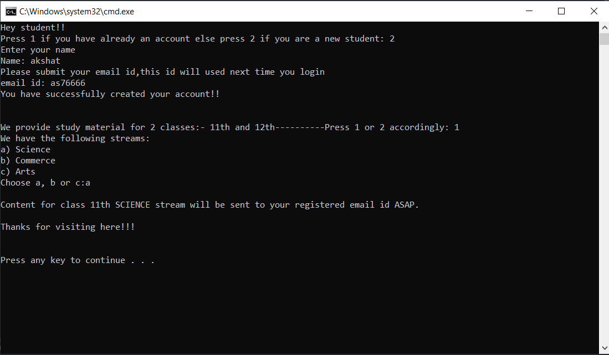

 <p align="center">
  
  
</p>


<h1 align="center">Welcome to LogIn Checker App 👋</h1>
<p>
  
  <a href="to be added" target="_blank">
    
  </a>
  <a href="nonee" target="_blank">
    
  </a>
  </p>

  > Authenticates the user login and provide the required material.
  ## APP PREVIEW

<p align="center">
  
   
</p>

 
## Run tests

```sh
execute .exe file
```


## Author

👤 **Akshat Sachan**

* Website: [PortFolio](https://sachan.netlify.app/)
* Twitter: [SachanAK36](https://twitter.com/sachanaks36)
* Github: [CryptocoderAS](https://github.com/CryptocoderAS)
* LinkedIn: [Akshat Sachan](https://www.linkedin.com/in/akshat-sachan-58b2921ab/)

## Show your support

Give a ⭐️ if this project helped you!

## 📝 License

Copyright © 2021 [Akshat Sachan](https://github.com/CryptocoderAS).<br />
This project is [Open Source](none) licensed.
